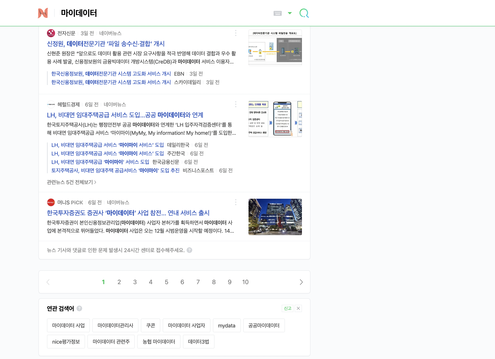
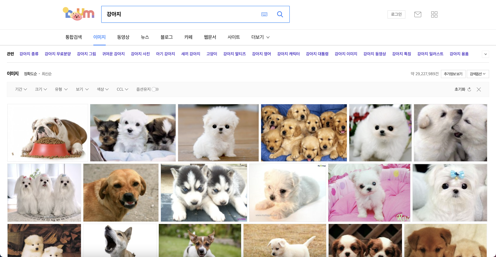

# codingchallenge-work
## 사이트 선정 기준
* 사이트의 Hit 수가 도움이 될 것
* 사이트에서 Scrapping 을 허용할 것 (robots.txt 파일 확인)
* 콘텐츠의 저작권 등에 문제가 없을 것
1. 네이버 뉴스 : 키워드 기반의 뉴스 기사 조회 > NewsScrapper
2. 포탈 사이트 : 키워드 기반의 이미지 검색 > ImageScrapper

## 버전
* Python Version 3.9.7
* Selenium Web Driver Version 93.0.4577.63 (lastest stable)
> https://chromedriver.storage.googleapis.com/index.html?path=93.0.4577.63/
## 패키지
### NewsScrapper (work.wc1)
#### 1. 용도
* 네이버 기준 언론사가 특정 키워드의 기사를 많이 송출하는지 확인하기 위한 스크래퍼
* 데이터 저장: SQLite3 사용
#### 2. 사이트 분석
* 로그인 여부와 관계 없이 동작
* JavaScript 등을 통한 HTML 페이지 표시 후 rendering 없음
* 여러 페이지를 동시 요청 가능
* 화면 예시

* URL 구조
> https://search.naver.com/search.naver?where=news&query={검색어}&start={(page_no -1)*10+1}
#### 3. class 구성
* requests, urllib.parse, beautifulsoup 등 사용
  * requests: 웹 페이지 요청
  * urllib.parse: quote 를 통한 한글 검색어 처리
  * beautifulsoup: 웹 페이지 parsing, CSS Selector 사용
* `__init__` : 검색어 및 최대 스크래핑 페이지 수 (default: 50)
* 각 함수의 로그성 메시지는 화면에 표시하고 호출 단계에 따라 tab 으로 들여쓰기
* 클래스 사용 시 gather 함수를 통하여 ayncio 에 대한 사용자 고려 없이 호출하도록 구성
* 비동기 호출 구조 : gather() -> __scrap_main() -> __scrap_page()
    * `gather()` : 호출 사용자 편리성 제공
    * `__scrap_main()` : 기본 20개의 scrap_page 르 비동기 호출
    * `__scrap_page()` : 1~10초 중 임의 대기 후 1개의 패이지 스크래핑
```
def gather():
  await asyncio.run(self.__scrap_main())

async def __scrap_main():
  for page in range(start + 1, end + 1):
    scrapper.append(asyncio.create_task(self.__scrap_page(page,header)))
 
  await asyncio.gather(*scrapper)

async def __scrap_page():
  await asyncio.sleep(1000)
```
* SQLite3 관련 기능의 경우 Function 기반으로 구성
### ImageScrapper
#### 1. 용도
* 다음 기준 키워드의 이미지를 파일로 저장하여 이후 학습 용도로 사용하기 위한 스크래퍼
* 데이터 저장
  * 작업 이력 - SQLite3 / 기존 NewsScarpper 의 jobs 테이블 활용, 
  * 이미지 - 파일
#### 2. 사이트 분석
* 로그인 여부와 관계 없이 동작
* HTML 페이지 표시 후 화면 rendering 
* 단일 페이지에 80개의 이미지 표출하며 scroll down 시 추가 이미지 rendering
* 화면 예시

* URL 구조
> https://search.daum.net/search?w=img&nil_search=btn&DA=NTB&enc=utf8&q={검색어}
#### 3. class 구성
* selenium, beautifulSoup, urllib.request.urlretreive 등 사용
  * selenium: Google Chorme 기준, scroll down 등 처리
  * beautifulsoup: 웹 페이지 parsing
  * urlretreive: 이미지 저장
* `__init__` : 검색어 및 최대 이미지 수 (default: 100)
* 각 함수의 로그성 메시지는 화면에 표시하고 호출 단계에 따라 tab 으로 들여쓰기
* 클래스 사용 시 gather 함수를 통하여 이미지 스크래핑 및 저장 처리
## main.py code snippet
```
keyword = "검색어"
conn = db.initalize()

scrapper = NewsScrapper(keyword)
scrapper.gather()

scrapper = ImageScrapper(keyword)
scrapper.gather()

db.finalize(conn)
```
## 단위 테스트
* pytest 를 통하여 NewsScrapper 맟 ImageScrapper 에 대하여만 테스트
```
pytest -v --html=./test-result/report/unittest-report.html
```
* Code Coverage 확인
```
pytest --cov=. --cov-report html:./test-result/report/coverage-report
```
## 정적 코드 분석
* SonarQube 를 통하여 정적 코드 분석
* 정적 코드 분석 불필요한 파일은 모두 삭제 권장 - bug/security report 증가
* Code Coverage 확인 등을 위한 사전 작업
```
pytest -v -o junit_family=xunit1 --cov=. --cov-report xml:test-result/coverage.xml  --junitxml=test-result/nosetests.xml
```
```
sonar-scanner \
  -Dsonar.projectKey=codingchallenge-work \
  -Dsonar.sources=. \
  -Dsonar.host.url=http://localhost:9000 \
  -Dsonar.login=cea0f2b4a9b24cc1ceaf2fb66c7354388f138bf1 \
  -Dsonar.python.coverage.reportPaths=./test-result/coverage.xml \
  -Dsonar.junit.reportPaths=./test-result/nosetests.xml
```